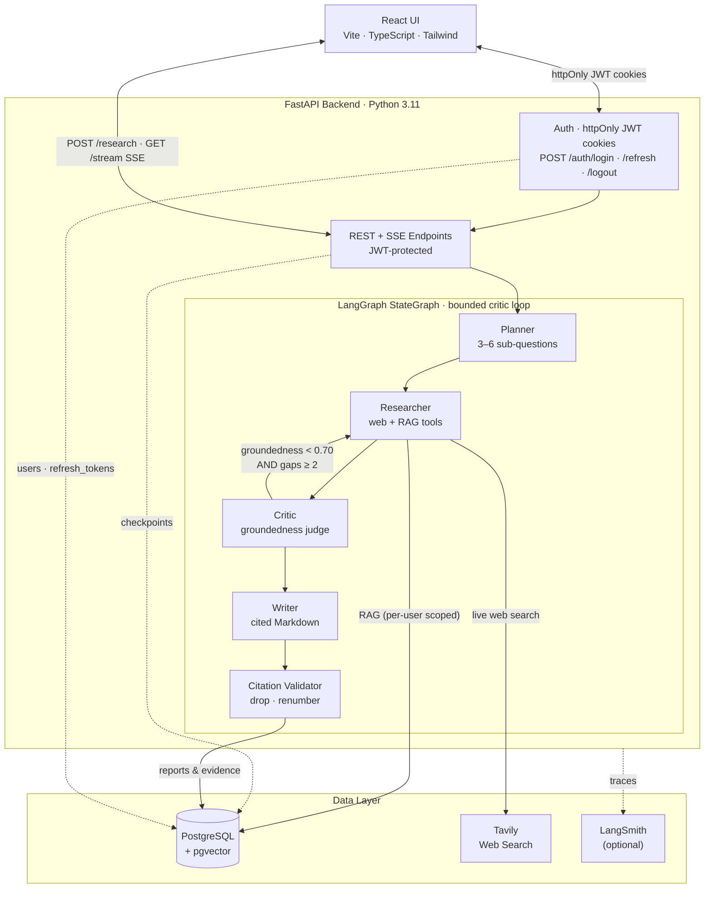

# Autonomous Research Analyst

A production-grade multi-agent system that accepts a research question, plans an investigation, gathers evidence from the live web and a private document corpus, critiques and fact-checks its own findings, and delivers a fully cited Markdown report.

**Stack:** LangGraph · FastAPI · PostgreSQL + pgvector · OpenAI · Tavily · React + Vite + TypeScript + Tailwind · LangSmith · Ragas · Docker Compose

---

## Measured results

Evaluated against a [16-item golden dataset](eval/golden.jsonl) covering RAG, LLM inference, and retrieval engineering. All numbers are for the **tightened critic gate** (production config):

| Metric | Score |
|---|---|
| **Citation accuracy** | **100%** |
| **Faithfulness** | **95.9%** |
| **Answer relevancy** | **90.2%** |
| **Context recall** | **96.9%** |
| **Hallucination rate** (1 − faithfulness) | **4.1%** |
| Latency / item | 46.5 s |

### Critic-loop A/B

The critic loop was tuned across three arms. The key finding: the original `needs_more_research` gate was over-eager — it fired on every item and produced a net-wash 7-help / 7-hurt picture at 2× cost. Tightening to **two independent signals** (low groundedness *and* multiple named gaps) cut hallucination by ~25% at near-OFF cost:

| Arm | Hallucination rate | Latency / item |
|---|---|---|
| Original gate (`needs_more_research`) | 5.5% | 77.6 s |
| Gate OFF (no loop-back) | 4.8% | 40.6 s |
| **Tightened** (`groundedness < 0.70 AND gaps ≥ 2`) | **4.1%** | 46.5 s |

The tightened gate fires on exactly 3 of 16 items — precisely where a second research pass is worth paying for. Full 3-way breakdown: [`eval/results/critic_three_way.md`](eval/results/critic_three_way.md)

> **Caveat (n=16).** Run-to-run noise floor on aggregate hallucination is ≈ ±1–2 pp at this dataset size. The direction (tightened ≤ original on hallucination, tightened ≈ OFF on cost) is robust as verified after more live runs and testing.

---

## Architecture



**Five agents, one graph:**

| Agent | Role |
|---|---|
| **Planner** | Decomposes the question into 3–6 targeted sub-questions |
| **Researcher** | Tool-using loop over `web_search` + `rag_retrieve`; returns structured `Evidence` |
| **Critic** | LLM-as-judge emitting a groundedness score + coverage gaps |
| **Writer** | Synthesizes a Markdown report citing evidence by `[ev:i]` markers |
| **Citation Validator** | Drops unsupported claims, assigns final `[1..k]` numbering + sources list |

---

## Quick start

Requires Docker and a `.env` file with your keys (copy from `.env.example`):

```bash
cp .env.example .env          # fill in OPENAI_API_KEY, TAVILY_API_KEY, and JWT_SECRET
docker compose up --build
```

`JWT_SECRET` is required — generate one with:

```bash
python -c 'import secrets; print(secrets.token_urlsafe(64))'
```

Three services start:

| Service | URL | Purpose |
|---|---|---|
| **React UI** | http://localhost:5173 | Register/sign in, submit questions, stream progress, read cited reports |
| **API** | http://localhost:8000 | FastAPI backend (Swagger at `/docs`) |
| **DB** | localhost:5432 | PostgreSQL + pgvector (schema applied on first boot) |

The API image has the embedding model (`BAAI/bge-small-en-v1.5`, 384-dim) baked in — no download on first run. The frontend container installs `node_modules` into a named volume on first boot (~30 s one-time cost).

Open `http://localhost:5173`, register an account, and submit a research question. All API endpoints except `/health` require a valid session cookie — use the UI for interactive access, or exercise the API directly via the Swagger docs at `http://localhost:8000/docs`.

---

## What's built

| Phase | Status | Summary |
|---|---|---|
| **Foundation** | ✅ | FastAPI + PostgreSQL/pgvector, one-command Docker bring-up, baked embedding model |
| **Retrieval** | ✅ | Document ingestion (chunk + embed + store), pgvector similarity search, Tavily web search |
| **Agent graph** | ✅ | `ResearchState` contract, 5 agent nodes, LangGraph `StateGraph` with bounded critic loop + Postgres checkpointing |
| **Async API** | ✅ | `POST /research` fires background run; SSE streams per-agent progress; full status lifecycle; LangSmith tracing |
| **Reliability** | ✅ | Per-call timeouts + retries, token budgets, clean failure path, startup zombie sweep, rate limiting on write endpoints, FK data-integrity guard on evidence persistence |
| **Eval harness** | ✅ | 16-item golden dataset, self-authored seed corpus, run/score/report pipeline; Ragas faithfulness + answer relevancy + context recall; LangSmith cost tracking |
| **Critic tuning** | ✅ | 3-arm A/B; tightened gate cuts hallucination 5.5% → 4.1% at near-OFF cost |
| **React UI** | ✅ | SSE-driven progress timeline, Markdown report, evidence inspector with citation-click-to-scroll, recent-runs sidebar |
| **Authentication** | ✅ | JWT httpOnly cookies (access + refresh); rotation backed by `refresh_tokens` table; per-user data isolation (sessions, documents, RAG); React login/signup UI with transparent auto-refresh |

---

## HTTP endpoints

| Method | Path | Auth | Purpose |
|---|---|---|---|
| `GET` | `/health` | public | Liveness check |
| `POST` | `/auth/register` | public | Register a new account |
| `POST` | `/auth/login` | public | Sign in; sets httpOnly access + refresh cookies |
| `POST` | `/auth/refresh` | cookie | Rotate tokens; issues a new cookie pair |
| `POST` | `/auth/logout` | cookie | Clears cookies; revokes refresh token server-side |
| `GET` | `/auth/me` | cookie | Return current user (used for page-refresh rehydration) |
| `POST` | `/documents` | required | Ingest raw text (JSON body) — chunk + embed + store |
| `POST` | `/documents/upload` | required | Ingest a file (`.txt` / `.md` / `.pdf`, ≤ 5 MB) |
| `POST` | `/research` | required | Start an async run; returns `session_id` immediately (202) |
| `GET` | `/research?limit=N` | required | List the authenticated user's recent runs |
| `GET` | `/research/{id}` | required | Poll status; returns report + `citations_valid` + `low_confidence` once done |
| `GET` | `/research/{id}/evidence` | required | Structured evidence for a session |
| `GET` | `/research/{id}/stream` | required | SSE stream of per-agent progress |

**Rate limiting.** The write endpoints are rate-limited (`slowapi`), keyed per authenticated user when logged in and per IP otherwise; a tripped limit returns `429`. Read-only GETs (status poll, SSE stream, list) are intentionally unlimited so the UI's polling isn't throttled. Limits: `POST /research` 10/min, `POST /documents[/upload]` 20/min (per user); `POST /auth/login` 10/min, `POST /auth/register` 5/min (per IP). Toggle with `RATE_LIMIT_ENABLED` (default on). Storage is in-process (single container); Redis is the multi-worker scale path.

---

## Local development

Run the DB in Docker, the backend and frontend on the host for hot-reload:

```bash
# ── Backend ──────────────────────────────────────────────────────────────────
python -m venv .venv && source .venv/bin/activate
pip install -e ".[dev]"
cp .env.example .env                    # fill in OPENAI_API_KEY, TAVILY_API_KEY, JWT_SECRET

docker compose up -d db                 # Postgres + pgvector on localhost:5432
uvicorn app.main:app --reload           # http://localhost:8000

# ── Frontend (separate shell) ─────────────────────────────────────────────────
cd frontend
npm install
npm run dev                             # http://localhost:5173
```

`VITE_API_URL` defaults to `http://localhost:8000`. Override in `frontend/.env.local` if your API port differs.

---

## Eval harness

```bash
docker compose up -d db
pip install -e ".[eval]"                 # Ragas + LangChain judge stack (pinned)

# Full pipeline over all 16 golden items (~30–60 min, costs LLM tokens)
python -m eval.run

# Cheaper alternatives
python -m eval.run --only-retrievability  # corpus check only, no LLM calls
python -m eval.run --limit 2              # smoke: first 2 items only

# Score and render
python -m eval.score                      # all six metric families
python -m eval.score --skip-ragas         # deterministic only (no judge cost)
python -m eval.report                     # writes eval/results/<run-id>.md

# A/B compare two scored runs
python -m eval.compare \
  --a <run-id-a> --b <run-id-b> \
  --name my_experiment \
  --label-a "Variant A" --label-b "Variant B"
```

Artifacts land in `eval/runs/<run-id>/` (gitignored). Per item: `report.md`, `evidence.jsonl`, `result.json`. Run-level: `scores.json`, `meta.json`, `retrievability.json`.

---

## Tests

```bash
# Fast unit tests — no external dependencies required
pytest -q

# Full suite (needs Postgres running)
docker compose up -d db
RUN_DB_TESTS=1 RUN_MODEL_TESTS=1 RUN_WEB_TESTS=1 RUN_LLM_TESTS=1 pytest -q
```

| Flag | What it enables |
|---|---|
| `RUN_DB_TESTS=1` | Tests requiring a live Postgres instance |
| `RUN_MODEL_TESTS=1` | Tests loading the real embedding model |
| `RUN_WEB_TESTS=1` | Live Tavily web-search test (needs `TAVILY_API_KEY`) |
| `RUN_LLM_TESTS=1` | Live LLM call via Planner (needs `OPENAI_API_KEY`) |

Frontend checks:

```bash
cd frontend
npm run typecheck   # tsc --noEmit, must be clean
npm run lint        # ESLint (typescript-eslint + react-hooks)
npm run test        # vitest unit tests (time helper + api layer)
npm run build       # production bundle
```

---

## Lint / format

```bash
ruff check .          # lint (CI gate)
ruff format .         # apply formatting
```

---

## Configuration

All settings from environment variables / `.env` (see [`.env.example`](./.env.example)):

| Variable | Default | Purpose |
|---|---|---|
| `DATABASE_URL` | — | Postgres connection string |
| `OPENAI_API_KEY` | — | LLM agents + Ragas judge |
| `TAVILY_API_KEY` | — | Web search (Researcher node + live test) |
| `LANGSMITH_API_KEY` | *(optional)* | Enable LangSmith tracing |
| `LANGSMITH_PROJECT` | `autonomous-research-analyst` | LangSmith project name |
| `LLM_TIMEOUT_SECONDS` | `120` | Per-call LLM hang ceiling |
| `LLM_MAX_RETRIES` | `2` | LLM retries on transient errors |
| `EMBEDDING_MODEL` | `BAAI/bge-small-en-v1.5` | Local sentence-transformer (384-dim) |
| `MAX_ITERATIONS` | `2` | Hard cap on the critic loop-back |
| `JWT_SECRET` | — | **Required.** Token signing key — generate with `python -c 'import secrets; print(secrets.token_urlsafe(64))'` |
| `ACCESS_TOKEN_EXPIRE_MINUTES` | `15` | Access token lifetime |
| `REFRESH_TOKEN_EXPIRE_DAYS` | `7` | Refresh token lifetime |
| `COOKIE_SECURE` | `false` | Set `true` in production (HTTPS only). Must be `false` for local `http://localhost` dev |
| `RATE_LIMIT_ENABLED` | `true` | Rate-limit the write endpoints (per-endpoint limits in `app/api/ratelimit.py`); set `false` for load testing |
| `VITE_API_URL` | `http://localhost:8000` | API base URL for the React app |
